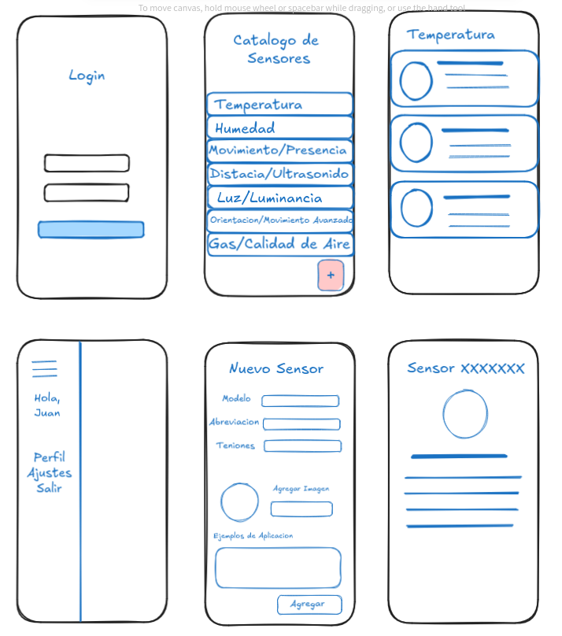
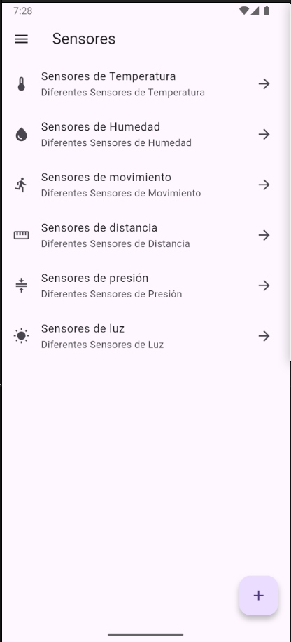

# 📱 SensoresApp

Aplicación Flutter para **gestionar, catalogar y consultar sensores electrónicos personales de forma rápida y ordenada**.

---

## 🛠 Sobre la aplicación

**SensoresApp** fue desarrollada como proyecto de la materia **Desarrollo de Aplicaciones Móviles**, materia electiva de la **carrera Ingeniería Electrónica en UTN FRBA**.  
La idea surgió mientras realizaba otro proyecto personal y me di cuenta de que **no sabía exactamente qué sensores tenía disponibles**.

Con esta app, cualquier estudiante o entusiasta de electrónica puede:
- **Registrar sensores electrónicos** que posee.
- Consultar **modelo, descripción, link a datasheet** y foto del sensor.
- **Organizar inventario de hardware** de forma clara.

---

✏️ Prototipo del proyecto

A continuación se muestra el prototipo inicial realizado en Excalidraw, donde se planificó la estructura de pantallas, navegación y funcionalidades principales de SensoresApp antes de comenzar el desarrollo en Flutter:



## 🚀 Funcionalidades actuales

✅ **Login y autenticación local**  
✅ **Base de datos local** (SQLite)  
✅ **Listado de sensores con detalles e imágenes**  
✅ **Menú lateral con:**
- Cuenta
- Configuración
- Cerrar sesión

✅ **Búsqueda y consulta rápida de sensores** para tus proyectos de electrónica.

---

## 📸 Screenshots

| Pantalla de inicio | Listado de sensores | Menú lateral |
|---------------------|----------------------|---------------|
|  |  |  |

---

## 🚧 Próximas actualizaciones

📌 Algunas funcionalidades que planeo agregar:

- [ ] Manejo de Base de Datos con Firestore Database.  
- [ ] Autenticar con Firebase Auth.  
- [ ] Galeria de Fotos.  
- [ ] Exportación a Excel / CSV del inventario.  
- [ ] Escaneo QR/NFC para identificar sensores rápidamente.  
- [ ] Poder cargar una foto como imagen del sensor.

---

## 🖥️ Cómo ejecutar localmente

Asegúrate de tener **Flutter instalado y configurado**:

```bash
flutter pub get
flutter run
